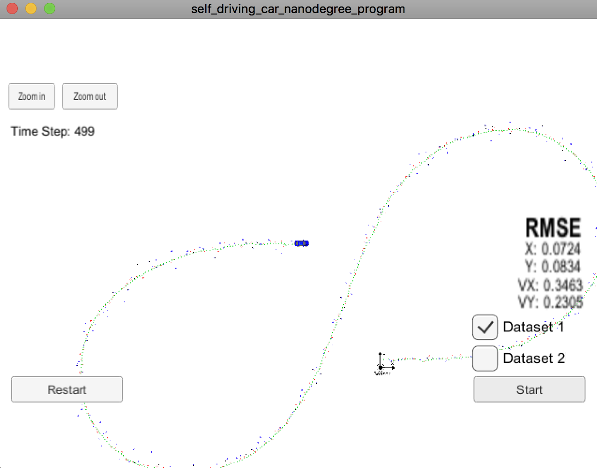
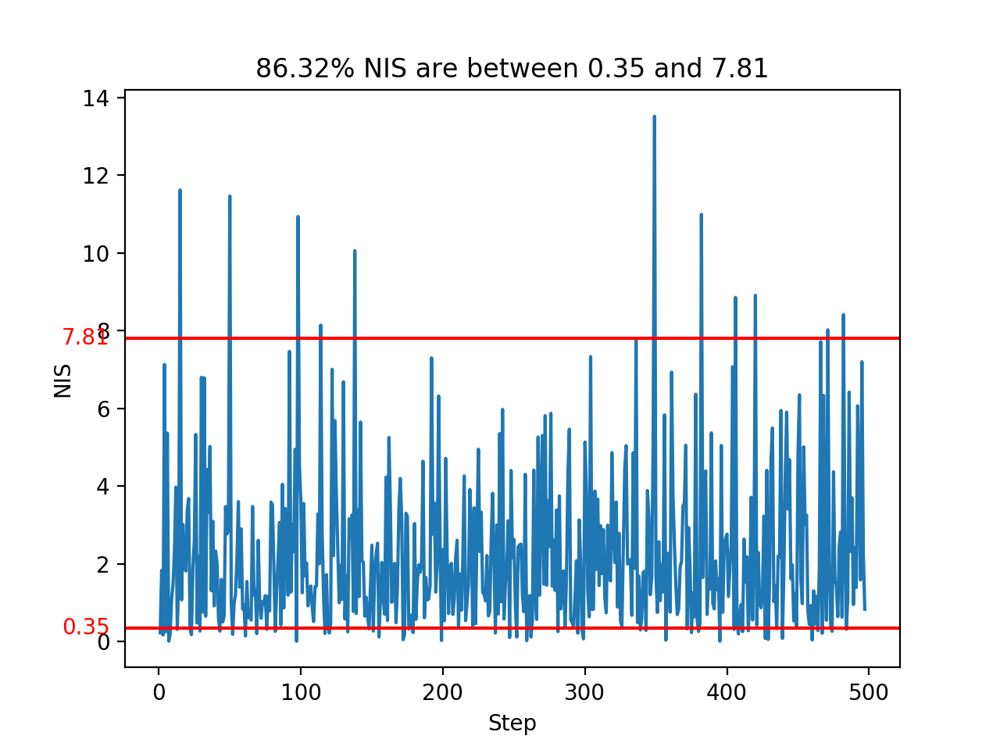

# Term 2 Project 2 - Unscented Kalman Filter 

## Overview

In this project I utilize an Unscented Kalman Filter to estimate the state of a moving object of interest with noisy lidar and radar measurements.

This project involves the Term 2 Simulator which can be downloaded [here](https://github.com/udacity/self-driving-car-sim/releases)

This repository includes two files that can be used to set up and intall [uWebSocketIO](https://github.com/uWebSockets/uWebSockets) for either Linux or Mac systems. For windows you can use either Docker, VMware, or even [Windows 10 Bash on Ubuntu](https://www.howtogeek.com/249966/how-to-install-and-use-the-linux-bash-shell-on-windows-10/) to install uWebSocketIO.

Once the install for uWebSocketIO is complete, the main program can be built and ran by doing the following from the project top directory.

1. mkdir build
2. cd build
3. cmake ..
4. make
5. ./UnscentedKF

Tips for setting up your environment can be found [here](https://classroom.udacity.com/nanodegrees/nd013/parts/40f38239-66b6-46ec-ae68-03afd8a601c8/modules/0949fca6-b379-42af-a919-ee50aa304e6a/lessons/f758c44c-5e40-4e01-93b5-1a82aa4e044f/concepts/23d376c7-0195-4276-bdf0-e02f1f3c665d)

Here is the main protcol that main.cpp uses for uWebSocketIO in communicating with the simulator.

INPUT: values provided by the simulator to the c++ program

["sensor_measurement"] => the measurment that the simulator observed (either lidar or radar)

OUTPUT: values provided by the c++ program to the simulator

["estimate_x"] <= kalman filter estimated position x
["estimate_y"] <= kalman filter estimated position y
["rmse_x"]
["rmse_y"]
["rmse_vx"]
["rmse_vy"]

### Generating Additional Data

If you'd like to generate your own radar and lidar data, see the
[utilities repo](https://github.com/udacity/CarND-Mercedes-SF-Utilities) for
Matlab scripts that can generate additional data.

### Other Important Dependencies

* cmake >= 3.5
  * All OSes: [click here for installation instructions](https://cmake.org/install/)
* make >= 4.1 (Linux, Mac), 3.81 (Windows)
  * Linux: make is installed by default on most Linux distros
  * Mac: [install Xcode command line tools to get make](https://developer.apple.com/xcode/features/)
  * Windows: [Click here for installation instructions](http://gnuwin32.sourceforge.net/packages/make.htm)
* gcc/g++ >= 5.4
  * Linux: gcc / g++ is installed by default on most Linux distros
  * Mac: same deal as make - [install Xcode command line tools](https://developer.apple.com/xcode/features/)
  * Windows: recommend using [MinGW](http://www.mingw.org/)

## [Rubric](https://review.udacity.com/#!/rubrics/783/view) Points
### Compiling
#### Your code should compile.
1. Clone this repo.
2. Make a build directory: `mkdir build && cd build`
3. Compile: `cmake .. && make` 
   * On windows, you may need to run: `cmake .. -G "Unix Makefiles" && make`
4. Run it: `./UnscentedKF `

The program executes without errors.

### Accuracy
#### px, py, vx, vy output coordinates must have an RMSE <= [.09, .10, 0.40, 0.30] when using the file: "obj_pose-laser-radar-synthetic-input.txt which is the same data file the simulator uses for Dataset 1"

My UKF accuracy is:

* Dataset 1 RMSE: [0.0724, 0.0834, 0.3463, 0.2305]

### Following the Correct Algorithm
#### Your Sensor Fusion algorithm follows the general processing flow as taught in the preceding lessons.

The Unscented Kalman filter implementation can be found [src/ukf.cpp](./src/ukf.cpp).

#### Your Kalman Filter algorithm handles the first measurements appropriately.

The first measurement is handled at [src/ukf.cpp](./src/ukf.cpp#L96)  from line 96 to line 125.

#### Your Kalman Filter algorithm first predicts then updates.

The predict operation could be found at [src/ukf.cpp](./src/FusionEKF.cpp#L129) line 129 and the update operation could be found at line 132 to 139.

#### Your Kalman Filter can handle radar and lidar measurements.

Two types of measurements are handled in [src/ukf.cpp](./src/FusionEKF.cpp#L132):

- For radar measurement from line 132.
- For lidar measurement from line 139.

### Code Efficiency

#### Your algorithm should avoid unnecessary calculations.

An example of simplified code is the general Update function at [src/ukf.cpp](./src/ukf.cpp#L284) line 284.

### Normalized Innovation Squared (NIS)
Used the helper script, I got the following NIS for all update steps of dataset1.

### Compare With Extended Kalman Filter
Recall the RMSE of EKF, which is [0.0973, 0.0855, 0.4513, 0.4399]. RMSE is lower for the unscented Kalman filter especially for velocity. Because the CTRV model is more precise than the constant velocity model from the EKF.